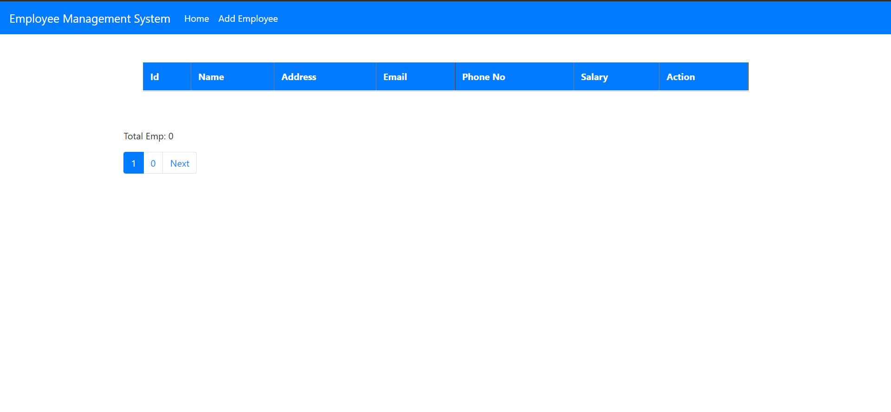
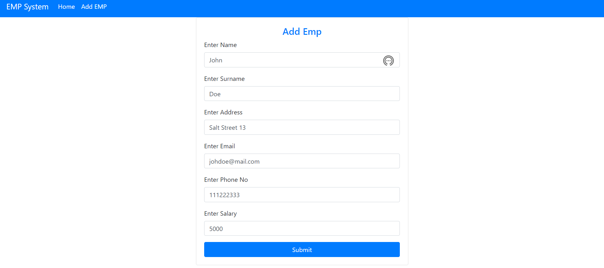
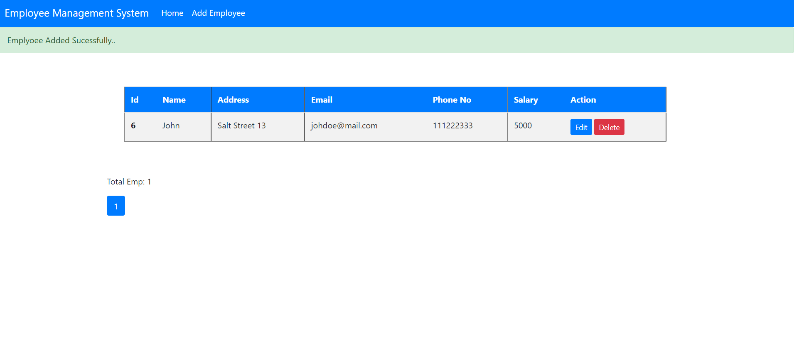
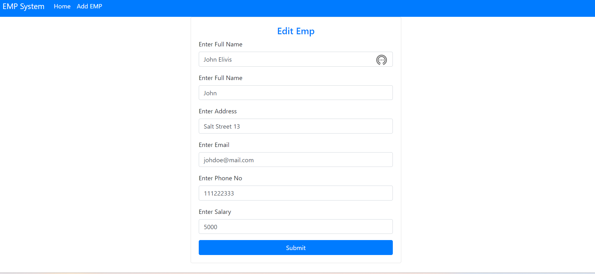
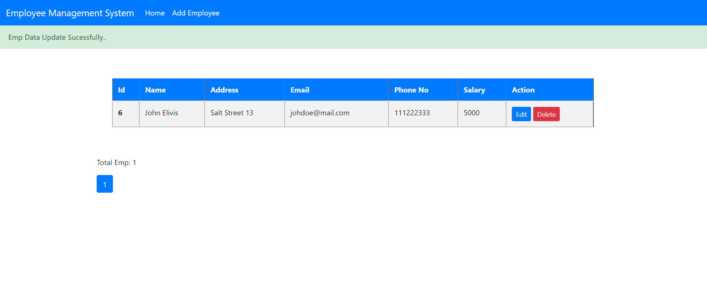
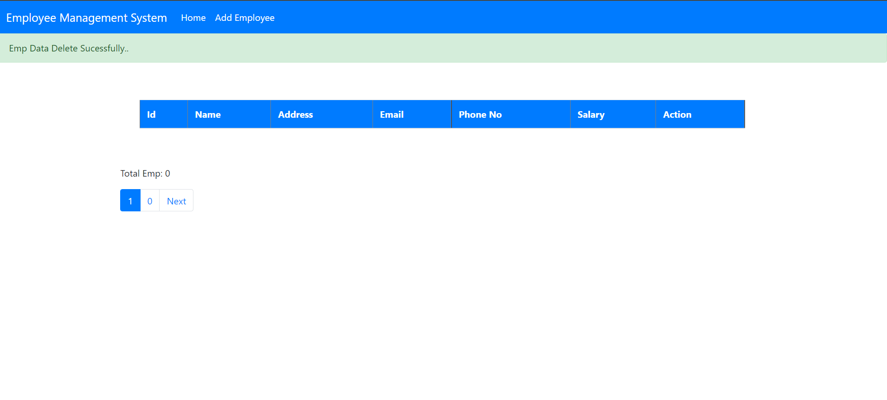

# Employee Management System

## Application is using local server 8080.
## It starts by running main method in EmployeeSystemApplication class.

## Used technologies:
Spring Boot,
Data JPA,
Lombok,
Gradle,
Thymeleaf,
MySQL

### Main View 

### Add Employee

### Edit Employee

### Delete Employee

